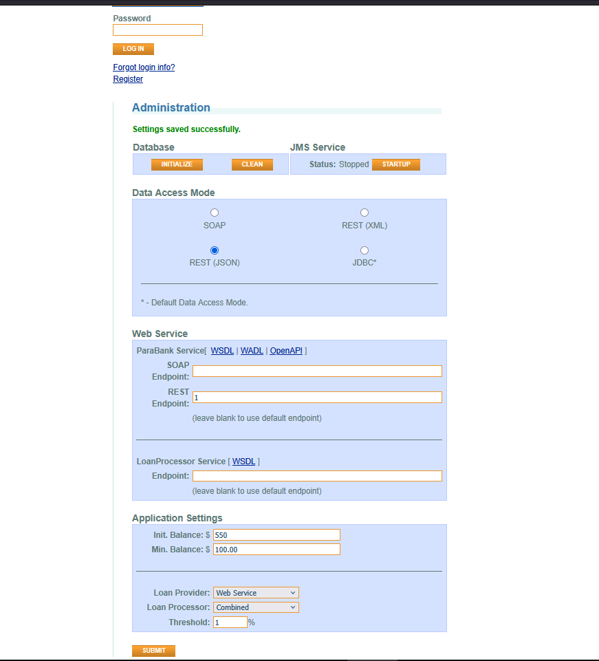
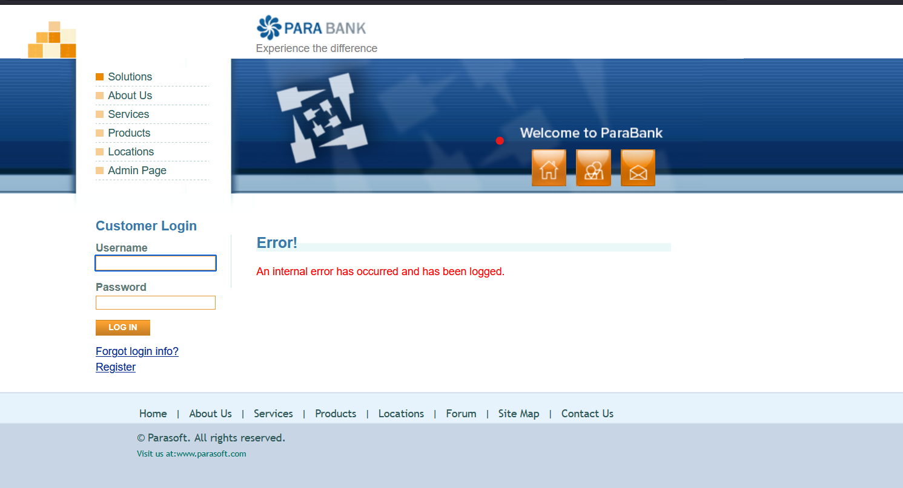

## Environment Details
- **Application:** ParaBank 
- **Address:** (`https://parabank.parasoft.com/parabank/admin.htm`)
- **Test Account:** N/A
- **Browser:** Brave
- **Date/Time:** 23.09.2026

## Severity & Priority
* **Severity:** Critical
  * *Reason:* The system allows unauthenticated configuration changes, lacks input validation, and completely crashes when invalid configurations are saved, rendering the entire application unusable.
* **Priority:** High

## Steps to Reproduce
1. Navigate to `https://parabank.parasoft.com/parabank/admin.htm`
2. Input in Web Service block and in used **Data Access Mode** input "1"
3. Click **Submit**

## Description
The system exhibits critical vulnerabilities and instability on the Administration. The system completely ignores input validation, accepting values such as "1" for web service endpoints (SOAP, REST, LoanProcessor). Most critically, when changing the Data Access Mode to SOAP or saving invalid endpoint values, the entire application stops functioning. Instead of standard responses, any subsequent operation returns a global internal error message.

## Observed Issues
* **Missing Input Validation:** Endpoint input fields successfully accept incorrect data, such as single digits (e.g., "1").
* **Critical System Failure (Application Crash):** After changing the Data Access Mode or saving invalid URLs, the application breaks and displays only the text "Error! An internal error has occurred and has been logged." for any subsequent action.

## Positive Scenario (Happy Path)
1. An authenticated administrator navigates to the Administration page.
2. The user enters valid, properly formatted URLs into the Web Service Endpoint fields.
3. The user selects the desired Data Access Mode (e.g., REST or SOAP).
4. The user clicks the submit button.
5. The system successfully validates and saves the data, after which it continues to operate stably without any functional disruptions.

## Expected Result
* The system must perform strict validation on entered URLs and reject invalid values (e.g., "1") with an appropriate error message prior to saving.
* Changing the Data Access Mode or entering erroneous endpoints must not cause the entire application to crash. If a database or service connection fails, the system should handle exceptions gracefully and return informative messages, not a generic "internal error".

## Actual Result
* The system saves incorrect configurations and mode changes without validation errors.
* Subsequently, the application ceases to function, returning the message "An internal error has occurred and has been logged." for all further requests.

## Attachments
* **Screenshots:**
  
  
