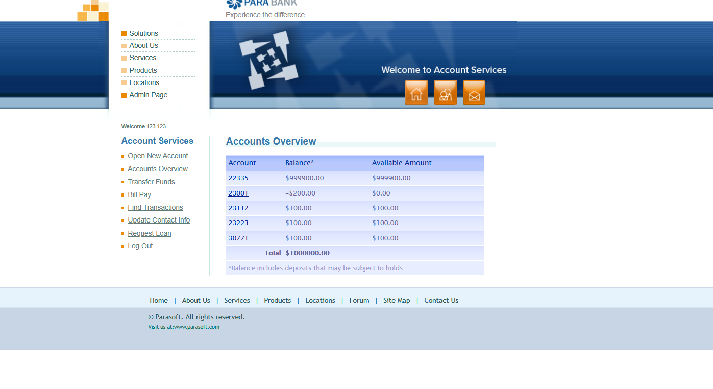
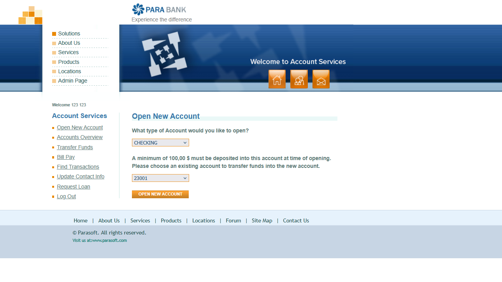

# BUG: "Open New Account" does not validate the funding account's available balance

## Environment Details
- **Application:** ParaBank
- **Address:** (`https://parabank.parasoft.com/parabank/openaccount.htm`)
- **Test Account:** 123 123 *(per "Welcome 123 123" shown in the screenshots)*
- **Browser:** Brave
- **Date/Time:** 23.09.2026

## Severity & Priority
- **Severity:** Critical
  - *Reason:* The system allows a new account to be funded from an existing account even when that account has $0.00 or negative available balance, letting the process be repeated to push an existing account's balance arbitrarily negative. This corrupts core financial data integrity.
- **Priority:** High

## Prerequisites / Pre-conditions
1. ParaBank is loaded.
2. User is successfully authenticated.
3. User has at least one existing account whose **Available Amount** is `$0.00` or negative (e.g., account `23001`, Balance `-$200.00`, Available Amount `$0.00` — see screenshot below).

## Steps to Reproduce
1. Navigate to `https://parabank.parasoft.com/parabank/openaccount.htm`.
2. In the **What type of Account** dropdown, select any account type (e.g., CHECKING).
3. In the funding-account dropdown, select an existing account whose Available Amount is `$0.00` or negative (e.g., `23001`).
4. Click **Open New Account**.
5. Repeat steps 2–4, opening additional accounts (e.g., SAVINGS) funded from the same or another account that already has insufficient/negative available balance.

## Description
The "Open New Account" page states that a minimum of $100.00 must be deposited from an existing account to open a new one. However, the system does not check whether the selected funding account actually has $100.00 (or any amount) of **available** balance before performing this transfer. As a result, a user can repeatedly open new accounts funded by an account that already shows $0.00 available, driving that account's balance further into the negative with no limit.

## Observed Issues
- **Missing Balance Validation:** The funding-account dropdown lets the user pick an account with `$0.00` Available Amount, and the transfer still succeeds.
- **Unbounded Negative Balance:** Account `23001` already shows Balance `-$200.00` / Available Amount `$0.00`, confirming the process can be repeated to push a balance arbitrarily negative.
- **No User Feedback:** No warning or error is shown indicating the funding account cannot cover the deposit.

## Positive Scenario (Happy Path)
1. An authenticated user navigates to the Open New Account page.
2. The user selects an account type and a funding account that has at least $100.00 available.
3. The user clicks **Open New Account**.
4. The system verifies the funding account's available balance is sufficient, deducts $100.00 from it, and creates the new account with that opening balance.
5. Both accounts' balances are correctly reflected in Accounts Overview, and neither balance goes below $0 as a result of this action.

## Expected Result
- The system must validate the funding account's **Available Amount** before opening a new account.
- If the funding account's available balance is less than the required minimum deposit, the system must reject the request and display a clear message (e.g., "Insufficient funds in account 23001 to open a new account").
- No action on this page should be able to drive an account's balance below $0.

## Actual Result
- The system accepts the request and creates the new account regardless of the funding account's available balance.
- Account `23001`, which already shows Available Amount `$0.00` (Balance `-$200.00`), was still accepted as a funding source — confirming the process can be repeated indefinitely with no balance floor.
- No validation error or warning is displayed at any point.

## Test Data / Edge Case Notes
> **Note:** the original draft's edge cases (invalid phone number, SSN, special characters, blank field) look like they belong to a text-input validation defect — most likely **Update Contact Info** or **Register** — not to this Open New Account / balance flow, which has no free-text input fields. They've been replaced below with cases relevant to this specific defect.

Relevant boundary values for the **funding account's available balance**:
- Available Amount = `$0.00` exactly (reproduced — see screenshots)
- Available Amount negative (e.g., `-$200.00`, already reproduced on account `23001`)
- Available Amount less than the minimum deposit but greater than $0 (e.g., `$50.00`)
- Available Amount exactly equal to the minimum deposit (`$100.00`)
- Available Amount just above the minimum (`$100.01`)

## Attachments
**Screenshots:**

1. Accounts Overview — account `23001` with Balance `-$200.00` and Available Amount `$0.00`:

   

2. Open New Account page — account `23001` selected as the funding source despite `$0.00` available:

   
