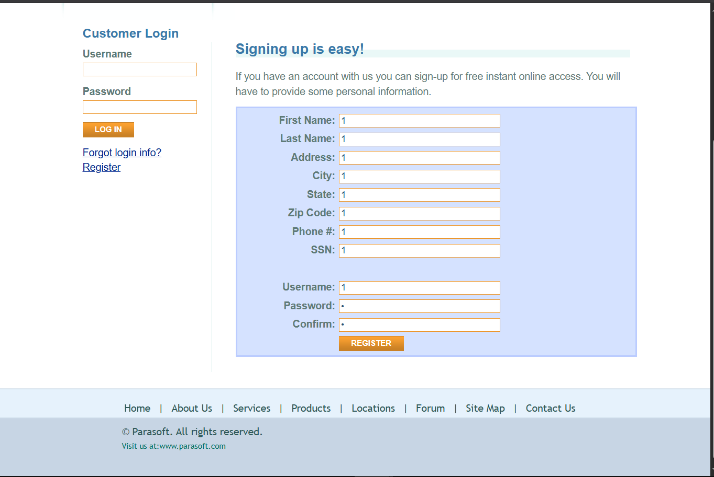
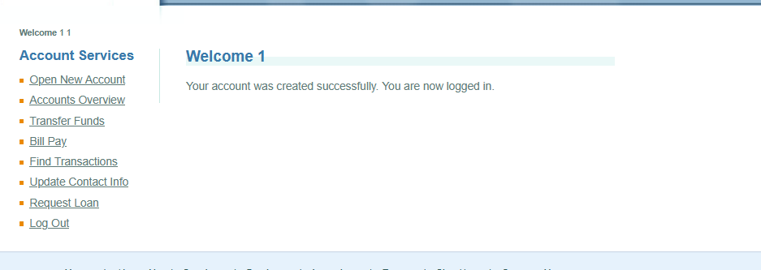

## Environment Details
- **Application:** ParaBank
- **Address:** (`https://parabank.parasoft.com/parabank/register.htm`)
- **Test Account:** 1
- **Browser:** Brave
- **Date/Time:** 23.09.2026

## Severity & Priority
- **Severity:** Critical
- **Priority:** High

## Prerequisites / Pre-conditions
1. ParaBank is loaded.

## Steps to Reproduce
1. Navigate to `https://parabank.parasoft.com/parabank/register.htm`.
2. Enter `1` into every field: First Name, Last Name, Address, City, State, Zip Code, Phone #, SSN, Username, Password, Confirm.
3. Click **Register**.

## Expected Result
The system should validate each field's format and either reject the request or highlight the invalid fields before submission — in particular:
- **SSN** should require a valid format (e.g. `XXX-XX-XXXX`), not a single digit.
- **Phone #** should require a valid phone format, not a single digit.
- **Zip Code** should require a valid postal code format.
- **State** should require a valid state value, not a single digit.
- **Address/City** should reject a single-character value as unrealistic input.

## Actual Result
The system accepted `1` as valid input in **every** field — including SSN, Phone #, Zip Code, and State, which have an obvious structured format — with no validation error. The account was created successfully and the user was immediately logged in as "Welcome 1", confirming there is no server-side (or client-side) format validation on the Register form.

## Test Data / Edge Case Notes
Reproduced with: `1` in all fields (see screenshots).

Other boundary values worth testing on the same fields:
- `12` (too short)
- `1234567890` (too long)
- `@#%` (special characters)
- `[blank]` (missing data)

## Attachments
- **Screenshots:**
- 
- 
