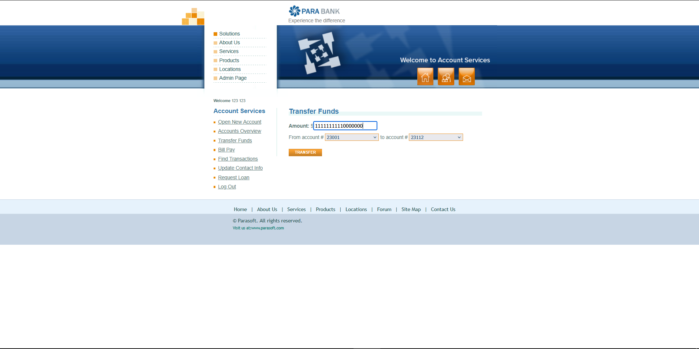
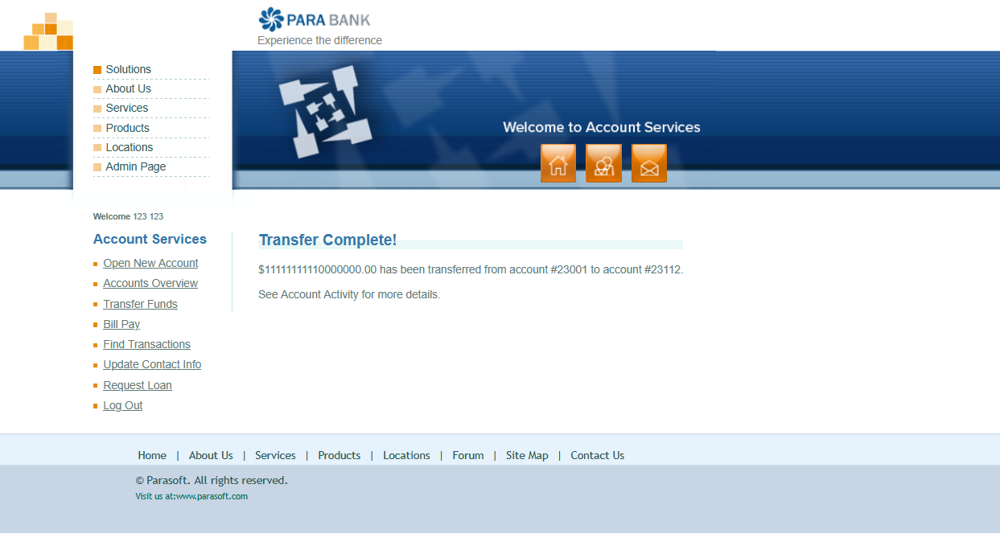

# BUG: "Transfer Funds" does not validate available balance and accepts amounts large enough to risk numeric overflow

## Environment Details
- **Application:** ParaBank
- **Address:** (`https://parabank.parasoft.com/parabank/transfer.htm`)
- **Test Account:** 123 123
- **Browser:** Brave
- **Date/Time:** 23.09.2026

## Severity & Priority
- **Severity:** Critical
  - *Reason:* The system allows a transfer to be submitted and completed from an account with $0.00 available balance, and accepts a transfer amount (18 digits, ≈$1.11 × 10^16) large enough to exceed the safe-integer range of standard floating-point numbers, risking silent balance corruption across the platform.
- **Priority:** High

## Prerequisites / Pre-conditions
1. ParaBank is loaded.
2. User is successfully authenticated.
3. Source account `23001` has Balance `-$200.00`, Available Amount `$0.00` (already reproduced — see `accounts-overview.png` from the previous report).

## Steps to Reproduce
1. Navigate to `https://parabank.parasoft.com/parabank/transfer.htm`.
2. In the **Amount** field, enter `11111111110000000` (18 digits, ≈$1.11 × 10^16).
3. Select **From account #** `23001` (Available Amount: `$0.00`).
4. Select **to account #** `23112`.
5. Click **TRANSFER**.

## Description
This single action surfaces two related defects:
- **(a) No balance validation:** Transfer Funds does not check whether the "From" account actually has enough — or any — available balance before processing the transfer. The transfer succeeds even though `23001` shows `$0.00` available.
- **(b) No upper bound on Amount → suspected precision/overflow issue:** The Amount field accepts an 18-digit value with no sanity limit. Numbers at this scale (~1.11 × 10^16) exceed `2^53` (≈9.007 × 10^15), the largest integer that IEEE-754 double-precision floating point — the numeric type typically used by JavaScript and many balance fields — can represent exactly. Beyond that boundary, values are rounded to the nearest representable double, which matches the "balance not fully/correctly displayed" behavior you observed and points to precision loss rather than a true $11,111,111,110,000,000.00 transfer.

## Observed Issues
- **Missing balance check:** transfer from an account with `$0.00` Available Amount is accepted.
- **No maximum-amount validation:** an 18-digit amount is accepted with no rejection or warning.
- **Confirmation screen shows the value as entered** (`transfer-complete-large-amount.png`), but the follow-on account balance is reported as not displaying correctly — consistent with a precision/overflow issue appearing downstream (Accounts Overview / Account Activity / stored balance), not on the confirmation message itself.

## Positive Scenario (Happy Path)
1. Authenticated user opens Transfer Funds.
2. Enters an amount within the "From" account's actual available balance and within a documented maximum transfer limit.
3. System validates both sufficiency of funds and the amount's format/range before processing.
4. Transfer completes, and Accounts Overview reflects the exact debited/credited amounts with no rounding or precision loss.

## Expected Result
- The system should reject the transfer when `Amount > From account's Available Amount`, regardless of how large or small the entered amount is.
- The system should enforce a sane maximum transfer amount, or otherwise process very large values without precision loss.
- If rejected, no "Transfer Complete!" message should appear and no balance/activity records should be created.

## Actual Result
- The transfer of `$11,111,111,110,000,000.00` from account `23001` (Available Amount `$0.00`) to `23112` was accepted and reported as complete (see `transfer-form-large-amount.png`, `transfer-complete-large-amount.png`).
- This confirms two risks flagged earlier in the Transfer Funds test checklist as high-priority: **TF-16** (amount over available balance should be rejected) and **TF-17** (very large amount should be validated/limited) — both fail in the live application.
- You reported that after this transfer, the account balance display does not show the full/correct amount, consistent with a numeric precision or overflow issue rather than reflecting the exact value transferred. *(Not yet captured in a screenshot — see note below.)*

## Test Data / Edge Case Notes
- `11111111110000000` (18 digits, ≈1.11 × 10^16) — exceeds the IEEE-754 double safe-integer limit (`2^53` ≈ 9.007 × 10^15); good candidate for reproducing precision loss.
- Recommend also testing values straddling `2^53` itself (`9007199254740992`, `9007199254740993`) to pinpoint exactly where display/storage starts to break.
- Recommend a separate, moderate-size but still over-balance amount (e.g. `$1,000,000`) to confirm the missing-balance-check bug reproduces independently of the overflow bug.

## Attachments
**Screenshots:**

1. Transfer Funds form — amount `11111111110000000` entered, From account `23001` (Available Amount `$0.00`), To account `23112`:

   

2. Transfer Complete confirmation — full 18-digit amount shown as transferred:

   

3. *(Needed)* Accounts Overview / Account Activity **after** this transfer, showing the incorrect/truncated balance — not yet attached. Please add this screenshot to confirm and pin down exactly what value is displayed (e.g. rounded number, scientific notation, negative wraparound).
