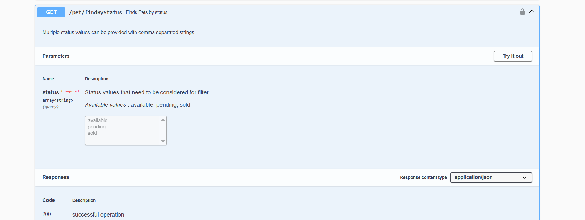
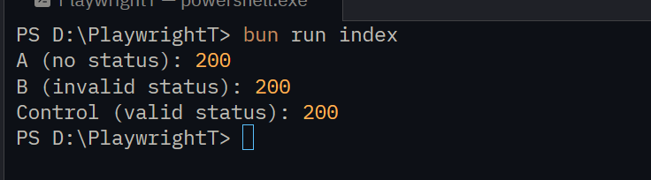

# Report: Discrepancy Between Swagger Documentation and Actual Petstore API Behavior

**Target under test:** Swagger Petstore, public demo instance  
**Base URL:** `https://petstore.swagger.io/v2`  
**Specification:** `https://petstore.swagger.io/v2/swagger.json` (OpenAPI/Swagger 2.0, version `1.0.7`)  
**Test Date:** 2026-09-23  

---

## 1. Methodology

To verify whether the actual API behavior aligns with its documentation, direct HTTP requests were executed against the public Swagger Petstore instance.

The API specification was retrieved from `swagger.json` at `https://petstore.swagger.io/v2/swagger.json` and used as the benchmark for expected endpoint behavior, including parameter requirements, allowed `enum` values, and documented HTTP response status codes.

Test requests were implemented in TypeScript using the standard `fetch` API. Each scenario used the `GET` HTTP method and the `Accept: application/json` header.

Three requests were executed for `GET /pet/findByStatus`:

1. **Without the `status` parameter** — to test API behavior when omitting a parameter marked as required in the specification.
2. **With an invalid `status` value** — sending `notarealstatus123`, which is not part of the allowed `enum` values.
3. **With a valid `status=available` value** — a control request to benchmark against the expected happy path.

TypeScript code used:

```typescript
const responseA = await fetch(
  "https://petstore.swagger.io/v2/pet/findByStatus",
  {
    method: "GET",
    headers: {
      accept: "application/json",
    },
  },
);

console.log("A (no status):", responseA.status);

const responseB = await fetch(
  "https://petstore.swagger.io/v2/pet/findByStatus?status=notarealstatus123",
  {
    method: "GET",
    headers: {
      accept: "application/json",
    },
  },
);

console.log("B (invalid status):", responseB.status);

const responseControl = await fetch(
  "https://petstore.swagger.io/v2/pet/findByStatus?status=available",
  {
    method: "GET",
    headers: {
      accept: "application/json",
    },
  },
);

console.log("Control (valid status):", responseControl.status);
```


## 2. Issue Description

### Endpoint
`GET /pet/findByStatus`

### What the documentation states (swagger.json)

Parameter `status`:
- `"in": "query"`
- **`"required": true`** — parameter is required;
- `"type": "array"` with `"enum": ["available", "pending", "sold"]` — only these three values are allowed;
- Documented response **`400 — "Invalid status value"`** for invalid values.



### What actually happens

**Test A — `status` parameter is completely missing from the request** (even though it is defined as required):

```
GET https://petstore.swagger.io/v2/pet/findByStatus
→ HTTP/1.1 200 OK
[]
```

**Test B — `status` value is not in the enum** (`notarealstatus123` instead of `available|pending|sold`):

```
GET https://petstore.swagger.io/v2/pet/findByStatus?status=notarealstatus123
→ HTTP/1.1 200 OK
[]
```

**Control — valid `status=available`** also returns `200 OK`. In other words, behavior for valid and invalid inputs is identical: the server never generates a `400`.



In none of the tests (missing required parameter, value outside enum) did the API return the documented **`400 Invalid status value`**. Instead, the server consistently responds with `200 OK` containing a JSON array (empty if there are no matches).

### Control Checks

To confirm this is not an issue with the test setup itself but specific behavior of this endpoint, other calls were tested:

- `GET /pet/1` → `200 OK`, returns a valid `Pet` object — **matches documentation**.
- `GET /store/order/1` → `404 Not Found` — **matches documentation** (a `404` is documented as possible).

---

## 3. Comparison Table

| Scenario | Expected per Documentation | Actual Behavior |
|---|---|---|
| `status` omitted (required parameter) | `400 Invalid status value` | `200 OK`, `[]` |
| `status=notarealstatus123` (outside enum) | `400 Invalid status value` | `200 OK`, `[]` |
| `status=available` (valid value) | `200 OK` | `200 OK`, `[]` |

---
