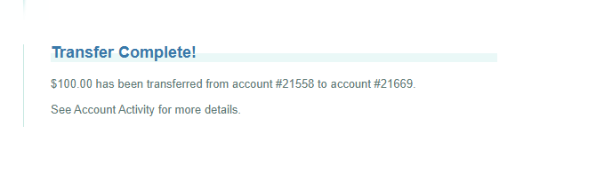
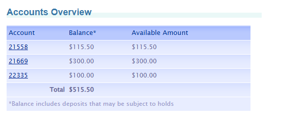
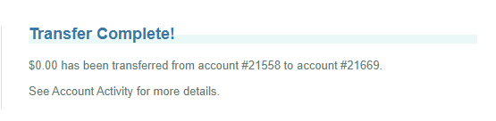
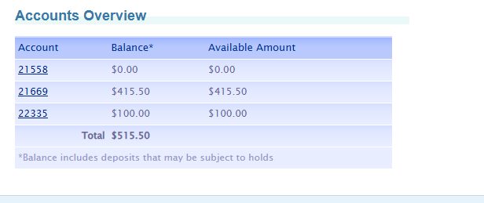
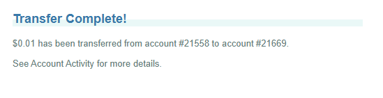
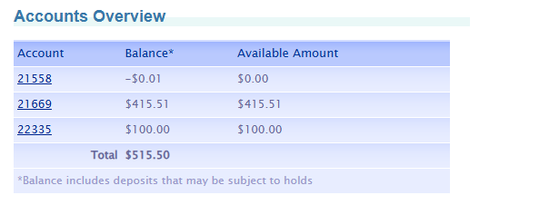

# ParaBank — Transfer Funds Test Checklist

**Feature:** Transfer Funds (`ParaBank → Transfer Funds`)
**Address:** `https://parabank.parasoft.com/parabank/transfer.htm`
**Date:** 23.09.2026
**Limit:** 25 checks max

Legend: **P** = Priority (High / Medium / Low) · **Type** = Positive / Negative / Boundary / State

---

## A. Positive Scenarios (core happy path)

| # | P | Type | Check | Expected Result |
|---|---|------|-------|------------------|
| TF-01 | High | Positive | Transfer a valid amount (e.g. $50) between two of the customer's own accounts | "Transfer Complete!" confirmation shown with correct From/To account numbers and amount |
| TF-02 | High | State | Open **Account Overview** (not the confirmation screen) after the transfer | Source account balance is reduced by exactly $100 |
| TF-03 | High | State | Open **Account Overview** for the destination account | Destination account balance is increased by exactly $100 |
| TF-04 | High | State | Check **Account Activity** of the source account | A new debit transaction exists with correct amount, date, description |
| TF-05 | High | State | Check **Account Activity** of the destination account | A matching credit transaction exists with correct amount, date, description |
| TF-06 | Medium | State | Sum balances across all of the customer's own accounts before vs. after the transfer | Total sum is unchanged (money is moved, not created/destroyed) |

## B. Negative Scenarios

| # | P | Type | Check | Expected Result |
|---|---|------|-------|------------------|
| TF-07 | High | Negative | Amount = `0` | Rejected with a validation message; no transaction created; balances unchanged |
| TF-08 | High | Negative | Amount is negative (e.g. `-10`) | Rejected; balances unchanged |
| TF-09 | High | Negative | Amount field left empty | Rejected with a "required field" message |
| TF-10 | High | Negative | Amount is non-numeric text (e.g. `abc`) | Rejected with a clear error — not a generic internal error page |
| TF-11 | Medium | Negative | "From" account = "To" account (transfer to itself) | System blocks it or clearly warns; verify actual behavior and balance impact |
| TF-12 | Medium | Negative | Amount has more than 2 decimals (e.g. `10.999`) | Consistent rounding rule or rejection — behavior is documented, not arbitrary |
| TF-13 | Low | Negative | Amount contains symbols/separators (e.g. `$1,000`) | Input is sanitized or rejected, not silently misparsed |

## C. Boundary Values (transfer amount)

| # | P | Type | Check | Expected Result |
|---|---|------|-------|------------------|
| TF-14 | Medium | Boundary | Amount = `$0.01` (smallest positive unit) | Transfer succeeds; both balances change by exactly $0.01 |
| TF-15 | High | Boundary | Amount = exact available balance of source account | Transfer succeeds; source balance becomes `$0.00` |
| TF-16 | High | Boundary | Amount = available balance + `$0.01` (one cent over) | Rejected as insufficient funds; source balance unchanged |
| TF-17 | Medium | Boundary | Amount is very large (e.g. `9999999.99`) | Validated/limited, not an overflow or crash |
| TF-18 | Low | Boundary | Amount with 1 decimal (e.g. `10.5`) | Accepted and correctly interpreted as `10.50` |

## D. State Verification Beyond the On-screen Message

| # | P | Type | Check | Expected Result |
|---|---|------|-------|------------------|
| TF-19 | High | State | Log out and log back in after a successful transfer | Balances and the new transactions are still correct (confirms server-side persistence) |
| TF-20 | High | State | Use **Find Transactions** (by date/amount) on both accounts | Debit and credit entries both exist with matching amount and timestamp |
| TF-21 | Medium | State | Refresh (F5) the confirmation page after a successful transfer | No duplicate transfer / double-debit is triggered |
| TF-22 | Medium | State | Double-click **Submit** on the transfer form | Only one transfer is processed, not two |

## E. Access & Data Integrity

| # | P | Type | Check | Expected Result |
|---|---|------|-------|------------------|
| TF-23 | High | Negative | Inspect the "To account" dropdown options | Only lists accounts belonging to the logged-in customer — no other customer's account is selectable |
| TF-24 | Medium | Negative | Attempt a transfer when the customer has only one account (no valid "To" option) | Form handles this gracefully — no crash, a clear message |
| TF-25 | Low | State | After a successful transfer, open an unrelated page (e.g. another account's activity) | Application remains stable — no global error state (cf. the Admin page defect) |

---

## Screenshots

| Test # | Screenshot |
|---|---|
| TF-01 |  |
| TF-02 |  |
| TF-07 |  |
| TF-15 |  |
| TF-16 |  |
| TF-19 |  |
